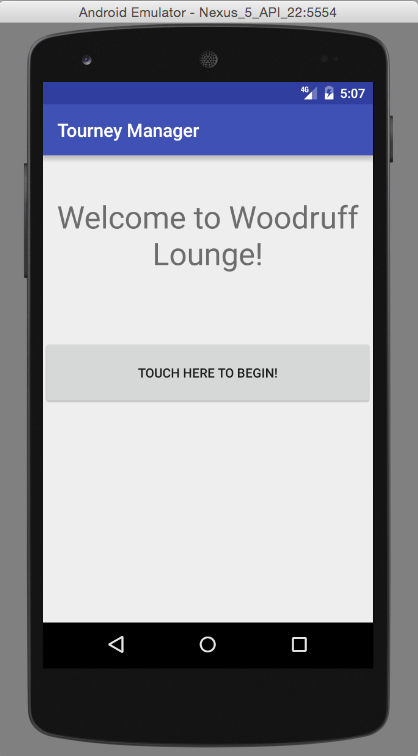
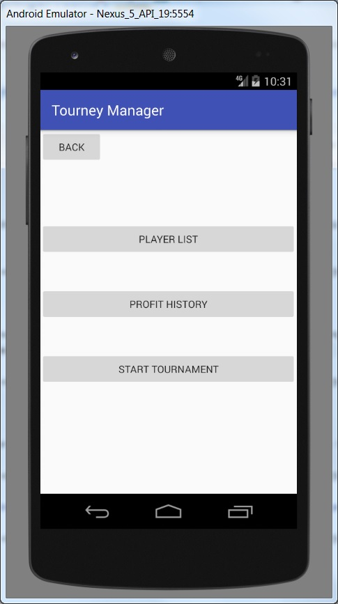
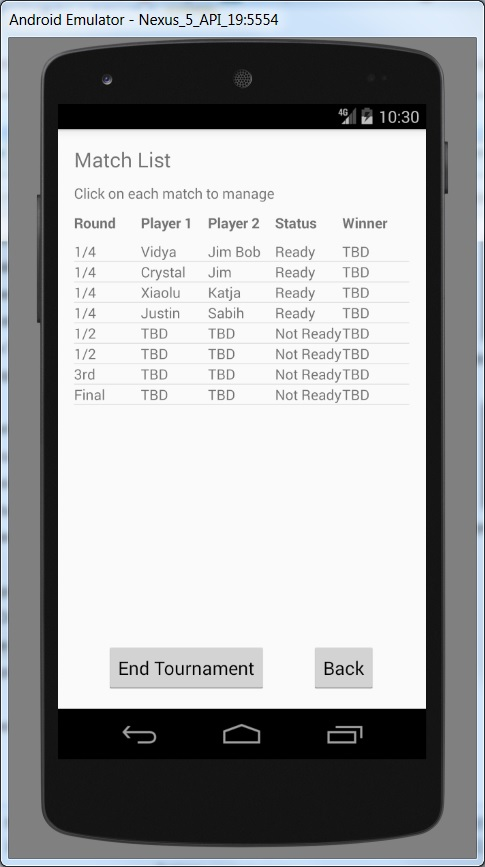
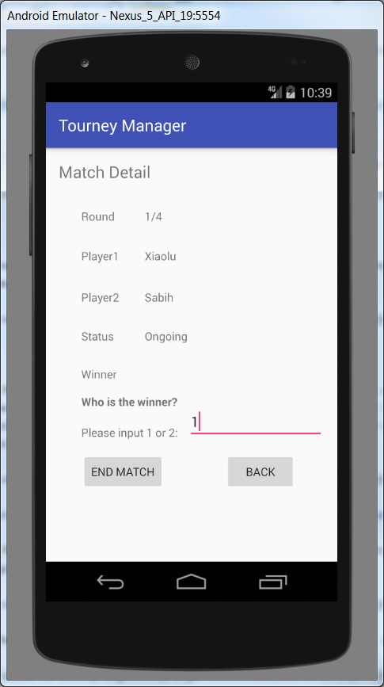
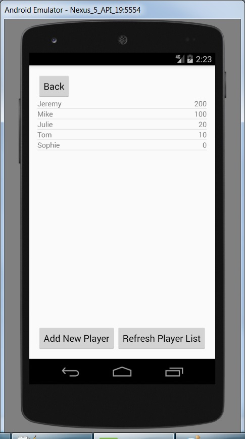
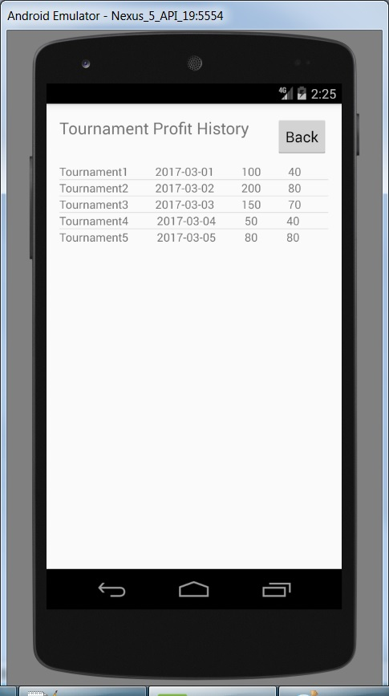
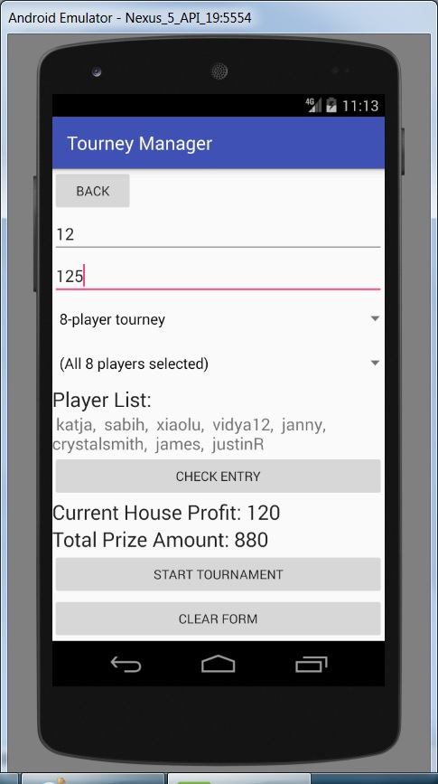
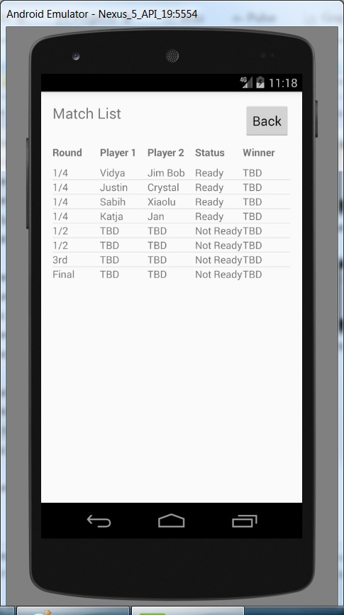
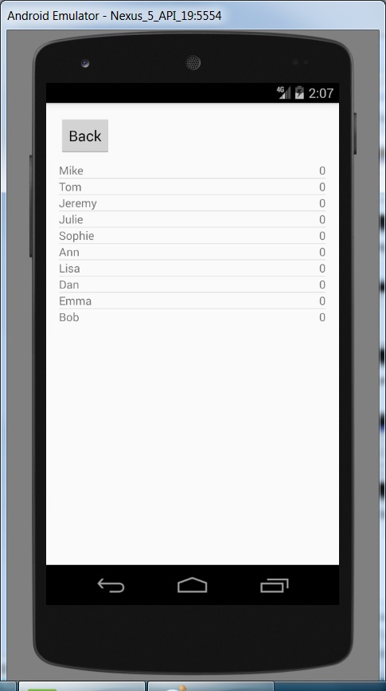

# User Manual

version 1.1

**Author**: Team 50

## 1 Introduction

Thank you for downloading the Woodruff Lounge Tournament Manager! This Android application allows you to manage players, create and run tournaments, and keep track of prize money. 

### 1.1 System Requirements

Woodruff Lounge	is a mobile application that runs on Android 4.4 (Kit Kit) or later. Please make sure you are running at least the minimum required version of the operating system. 

## 2 How to Use Woodruff Lounge Tournament Manager

The Woodruff Lounge Tournament Manager has two mode, the **Manager Mode** and the **Player Mode**. The **Manager Mode** allows a user to add players to the system, as well as to start and manage a tournament.  The **Player Mode** allows a user to see a list of player (when there is no ongoing tournament), as well as a list of matches when there is tournament in progress.  

### 2.1 Starting the application

On startup, a user is presented with a splash screen. Please touch or tap the button in the middle of the screen to begin using the application.  



### 2.1 Manager Mode

Manager Mode allows tournament manager to view and edit the list of matches (if there is an ongoing tournament), the list of players, view the profit history for all tournaments, and to start a tournament if one is not in progress.



#### 2.1.1 Match List

When a tournament is in progress, Manager Mode opens a Match List, which shows the tournament manager the list of matches for the ongoing tournament and allows to start a match, if both players have been determined. Initially, only the matches for the first round (quarterfinal, i.e., 1/4, or "round of 8" in an 8-player tournament or 1/8th round, or "round of 16" in a 16-player tournament) are ready. Once both matches from the previous round a completed, the next round match is ready to play.



> **Note:** When there is no ongoing tournament, no matches are shown, as none are played or pending.

When a tournament is ongoing, the Manager can start a match by tapping on the match in the Match list and then tapping the Start button. The status of the match will change to ongoing.


When the match is completed, the Manager can end it by specifying the winner, either Player 1 or Player 2.



Once all matches are played and marked completed in the system, the Manager can end the tournament. 

> **Note:** If a tournament is ended before all matches are played, the funds are refunded and the record of the tournament is removed from the profit history.

#### 2.1.2 Player List

Player list allows manager to see the status of all matches if there is an ongoing tournament, or, if there is none, the list of all players in the system.



#### 2.1.3 Profit History

Profit History screen allows tournament manager to view a history of house profits for all completed tournaments.



#### 2.1.4 Start Tournament

Start Tournament screen allows tournament manager to start a tournament if one is not already in progress.

In order to start a tournament, tournament manager must enter the house cut (as a percentage) and the entry fee (per player), as well as the number of players (**8 or 16**). The application will then populate the list of players for the tournament from the list of available players and calculate  the house profit, as well as 1st, 2nd, and 3rd prizes.

> **Note:** If there are fewer than 8 players in the system, the Start Tournament screen won't show. Instead, the user will be presented with the suggestion to add more users.  If there are fewer than 16 but more than 8 players in the system, only the option to start an 8-person tournament will be available.

The house profit is calculated using the following formula:

House profit = Number of players * Entry fee * House cut.

For example, if there are 8 players in a tournament, the entry fee is $100, and the house cut is 20%, then:

```
House profit = 8 * $100 * 0.2 = $160
```

First place prize is calculated as 50% of the pot after the house cut.  Using the above example,

```
1st place = 8 * $100 * 0.8 * 0.5 = $320.
```

Second place prize is calculated as 30% of the pot after the house cut. Using the same example,

```
2nd place = 8 * $100 * 0.8 * 0.3 = $192.
```

Third place prize is calculated as the remaining pot, or 20% of the pot after the house cut.  Using the same example,

```
3rd place = 8 * $100 * 0.8 * 0.2 = $128.
```
 


### 2.2 Player Mode

Player mode has two options, Match List and Player List. Match List is shown when the tournament is ongoing, while Player List is shown when there is no tournament (and thus no matches).

#### 2.2.1 Match List 

Through the Player Mode, Match List option allows the player to see (but not edit), the list of all matches for the current tournament, as well as their status.




#### 2.2.2 Player List

Through the Player Mode, Player List option allows the player to see (though not edit) the list of all players in the system.



### 3 How to get support

We hope you enjoy the application. Should you experience any problems, please submit an issue.
